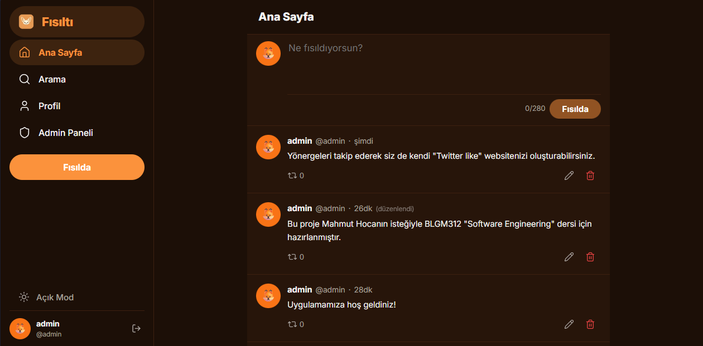

# Fısıltı

Fısıltı, kullanıcıların gönderi paylaşabildiği, profil oluşturabildiği ve birbirini takip edebildiği modern bir sosyal platformdur. Proje; BLGM312 Dersi için full-stack mimari, güvenli auth akışları ve production deploy deneyimi kazanmak amacıyla geliştirilmiştir.

**Canlı Demo:** [fisilti.ysferencakir.info.tr](https://fisilti.ysferencakir.info.tr)
**Backend API:** [fisilti-api-oshl.onrender.com](https://fisilti-api-oshl.onrender.com)

---

## Özellikler

- Kullanıcı kaydı, girişi ve email doğrulama
- JWT tabanlı kimlik doğrulama (access + refresh token)
- Şifre sıfırlama (email ile)
- Gönderi oluşturma, düzenleme, silme ve repost
- Kullanıcı profili ve takip/takipçi sistemi
- Hesap pasifleştirme
- Login deneme limiti (rate limiting)
- Responsive tasarım — mobilde bottom navigation
- CORS, environment variable ve production güvenlik ayarları

---

## Mimari

```
Kullanıcı Tarayıcısı (Vercel)
        ↓ HTTPS
Django REST API (Render)
        ↓
Neon PostgreSQL (serverless)
        ↓
Gmail SMTP (email)
```

**Frontend** (Vercel): React + Vite SPA. Tüm routing client-side, Vercel SPA rewrite ile destekleniyor.

**Backend** (Render): Django REST Framework, Gunicorn ile servis ediliyor. WhiteNoise static dosya yönetimi.

**Veritabanı** (Neon): Serverless PostgreSQL. SSL ile bağlantı, `dj-database-url` ile parse ediliyor.

---

## Teknolojiler

| Katman | Teknolojiler |
|--------|-------------|
| Frontend | React, Vite, React Router, Axios |
| Backend | Python, Django, Django REST Framework |
| Auth | JWT (SimpleJWT), refresh token rotation |
| Veritabanı | PostgreSQL (Neon) |
| Deployment | Vercel (frontend), Render (backend) |
| Email | Gmail SMTP |
| Altyapı | Docker Compose (local), Gunicorn, WhiteNoise |

---

## Auth ve Güvenlik

- **JWT:** Access token (60 dk) + refresh token (7 gün). Token rotation aktif; her refresh'te yeni refresh token üretilip eskisi blacklist'e alınıyor.
- **Email doğrulama:** Kayıt sonrası 6 haneli OTP kodu email ile gönderiliyor. 10 dakika geçerli, 5 yanlış denemeden sonra kilitleniyor.
- **Şifre sıfırlama:** UUID token içeren link email'e gönderiliyor. 1 saat geçerli, tek kullanımlık.
- **Login throttle:** Son 15 dakikada 5 başarısız denemeden sonra hesap geçici olarak kilitleniyor. DB tabanlı, email bazlı.
- **Public/private endpoint ayrımı:** Axios interceptor auth endpointlerine (`/auth/login/`, `/auth/register/` vb.) token eklemiyor; expired token karışıklığı engelleniyor.
- **CORS:** `CORS_ALLOWED_ORIGINS` env variable ile yönetiliyor, production'da sadece frontend domain'i açık.
- **Hesap güvenliği:** Multi-tab token karışıklığına karşı deactivate işleminden önce backend'den canlı kullanıcı doğrulaması yapılıyor.

---

## Production Deploy

Projeyi production'a taşırken karşılaşılan ve çözülen başlıca problemler:

- **CORS ve API URL:** Frontend `VITE_API_BASE_URL` ile backend URL'ini alıyor. `/api` prefix'i yanlış ayarlanınca tüm istekler 404 dönüyordu; env variable ve baseURL senkronize edildi.
- **SPA routing:** Vercel'de sayfa yenilenince 404 alınıyordu. `frontend/vercel.json` ile SPA rewrite eklendi.
- **Static files:** `STATICFILES_DIRS` frontend build klasörüne işaret ediyordu; Render'da bu klasör olmadığı için `collectstatic` başarısız oluyordu. `exists()` kontrolüyle düzeltildi.
- **Token yönetimi:** Expired token localStorage'da kalınca login isteği interceptor tarafından engelleniyor ve "oturum süresi doldu" hatası üretiliyordu. Login submit başında token temizleme ve public endpoint ayrımı ile çözüldü.
- **Environment variables:** Render ve Vercel dashboard'da tüm secret'lar env variable olarak yönetiliyor; kod içinde hardcoded değer yok.

---

## Kurulum

### Gereksinimler

- Python 3.11+
- Node.js 18+
- PostgreSQL (veya Neon bağlantısı)

### Backend

```bash
cd backend
python -m venv .venv

# Linux/macOS
source .venv/bin/activate

# Windows
.venv\Scripts\activate

pip install -r requirements.txt
cp .env.example .env   # .env dosyasını düzenle
python manage.py migrate
python manage.py runserver
```

### Frontend

```bash
cd frontend
npm install
cp .env.example .env   # VITE_API_BASE_URL ayarla
npm run dev
```

---

## Environment Variables

**Backend** (`backend/.env`):

```env
DEBUG=True
SECRET_KEY=
DATABASE_URL=
ALLOWED_HOSTS=localhost,127.0.0.1
CORS_ALLOWED_ORIGINS=http://localhost:5173
FRONTEND_URL=http://localhost:5173
PASSWORD_RESET_FRONTEND_URL=http://localhost:5173/password-reset
REQUIRE_EMAIL_VERIFICATION=True
EMAIL_HOST=smtp.gmail.com
EMAIL_PORT=587
EMAIL_USE_TLS=True
EMAIL_HOST_USER=
EMAIL_HOST_PASSWORD=
DEFAULT_FROM_EMAIL=
```

**Frontend** (`frontend/.env`):

```env
VITE_API_BASE_URL=http://localhost:8000/api
```

---

## API Endpoints (Özet)

```
POST   /api/auth/register/
POST   /api/auth/login/
POST   /api/auth/verify-email/
POST   /api/auth/resend-verification/
POST   /api/auth/password-reset/
POST   /api/auth/password-reset/confirm/
POST   /api/auth/token/refresh/
POST   /api/auth/logout/

GET    /api/users/me/
PATCH  /api/users/me/
DELETE /api/users/me/
GET    /api/users/<username>/

GET    /api/posts/feed/
POST   /api/posts/
PATCH  /api/posts/<id>/
DELETE /api/posts/<id>/
POST   /api/posts/<id>/repost/

POST   /api/follows/<username>/follow/
DELETE /api/follows/<username>/follow/
GET    /api/follows/<username>/followers/
GET    /api/follows/<username>/following/
```

---

## Öğrendiklerimiz

Bu proje boyunca production ortamında karşılaşılan ve çözülen başlıca problemler:

- **Frontend/backend ayrımı:** SPA routing, CORS ve API base URL yönetimi local'de görünmez ama production'da kritik hale geliyor.
- **Token lifecycle yönetimi:** Access token expire olduğunda interceptor'ın login isteğini de bloklayabileceği; public/private endpoint ayrımının neden gerekli olduğu anlaşıldı.
- **Deployment debugging:** Render'da `collectstatic` hataları, Vercel'de SPA routing sorunları ve environment variable uyumsuzlukları adım adım izole edilerek çözüldü.
- **Güvenlik detayları:** Multi-tab token karışıklığı gibi edge case'ler; rate limiting ve login throttle'ın gerçek kullanımda nasıl davrandığı incelendi.
- **Email akışları:** OTP tabanlı doğrulama ile link tabanlı şifre sıfırlama arasındaki farklar ve her birinin UX/güvenlik dengesi değerlendirildi.

---

## Proje Ekibi

Bu proje, BLGM312 Software Engineering dersi kapsamında ekip çalışması olarak geliştirilmiştir.

| İsim | Rol |
|------|-----|
| Yusuf Eren Çakır | Proje Yöneticisi / Web Geliştiricisi |
| Kadircan Alaca | Veritabanı Geliştiricisi / Web Geliştiricisi |
| Görkem Yümsel | Kullanıcı Arayüzü Tasarımcısı / Web Geliştiricisi |
| Kaan Soruş | Ağ Tasarımcısı / Test Uzmanı / Web Geliştiricisi |

---

## Ekran Görüntüleri



---

## İletişim

**GitHub:** [@ysferencakir](https://github.com/ysferencakir)
**LinkedIn:** https://www.linkedin.com/in/yusuferencakir/
**E-posta:** ysferencakir@gmail.com